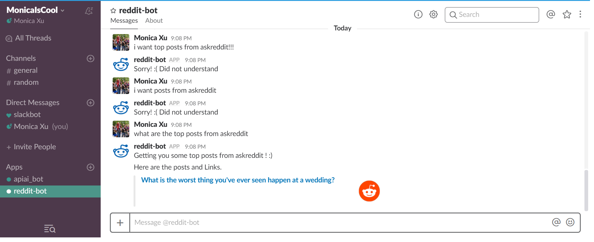
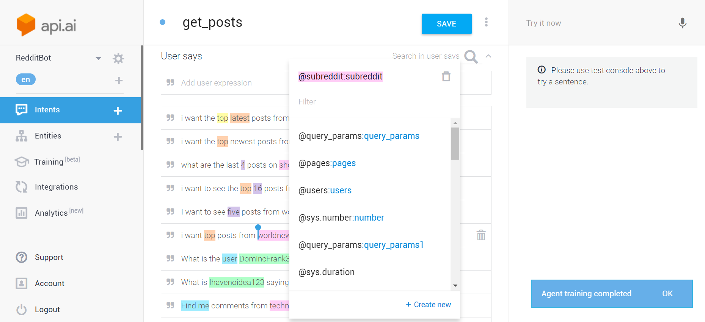
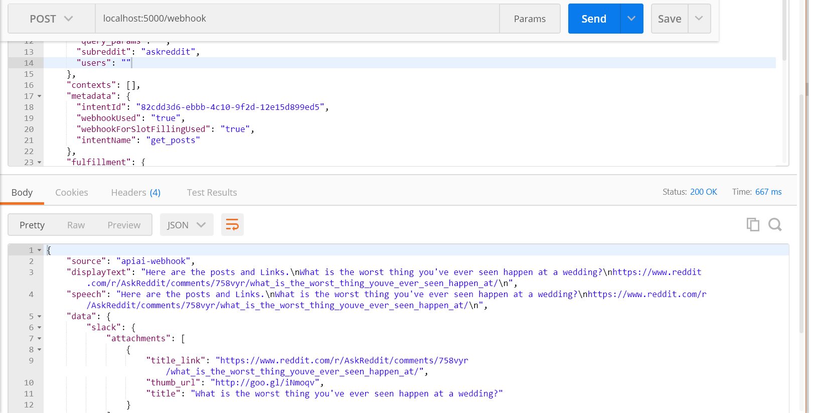

# reddit-bot

This is a Slackbot that allows you to browse Reddit while at work.
Now you can read posts from your company's communication channels :) hehe

 * Webhook built on Flask server
 * NLP and Machine Learning with API AI
 * All hosted and deployed on Heroku at http://redditbot2000.herokuapp.com
 
 # Demo of the Chatbot (work in progress)
 
 
 # Demo of API AI Training - Establishing intents and entities
 
 
 # Demo of response from POSTing to the Webhook
 
